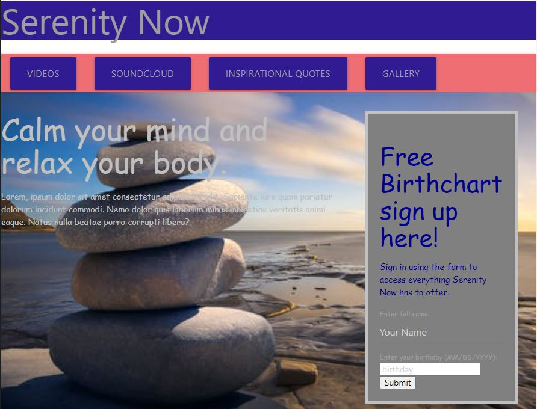

# Serenity Now

## Purpose
This app is designed to help the user decompress from the stresses of life. When the app is opened, The user is presented with a navigation menu. Clicking on one of the menu options will jump the page to the appropriate section. Users can access calming videos, inspirational quotes, and soundbaths using the app. The user can enter their name and birthday to receive a birthchart.

## Built With
*HTML 
*CSS 
*JS 

## Web Link:
https://andrea-rowland.github.io/serenity-now/

## Screenshot:
